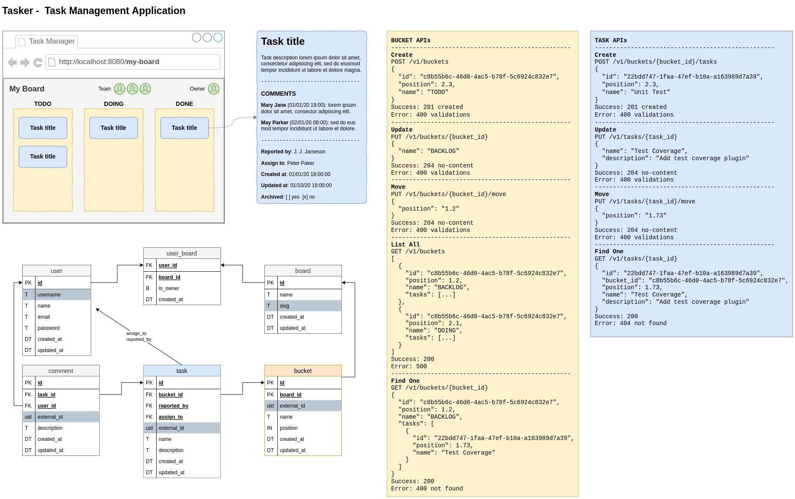

# Tasker - Task Management Application

## TODO
- [ ] OpenAPI Specification
- [ ] Sonarqube
- [ ] Externalize authentication and authorization with KeyCloak
- [ ] Check the package update in the deployment pipeline

## Architecture knowledge base
**ADR**: https://mariorez.github.io/tasker/log4brains/

## General

**Verificar atualização dos pacotes**
```
mvn versions:display-dependency-updates
```

**Verificar atualização dos plugins**
```
mvn versions:display-plugin-updates
```

## Docs


